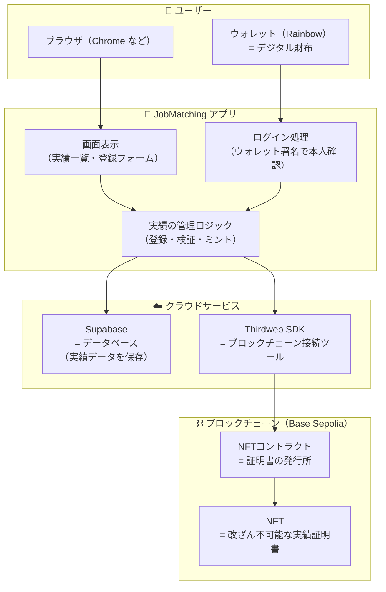
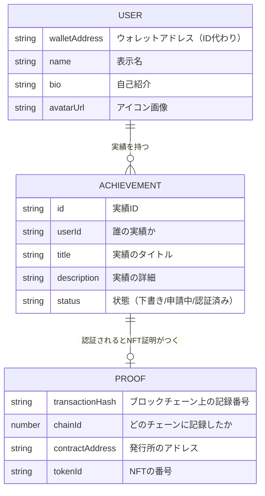
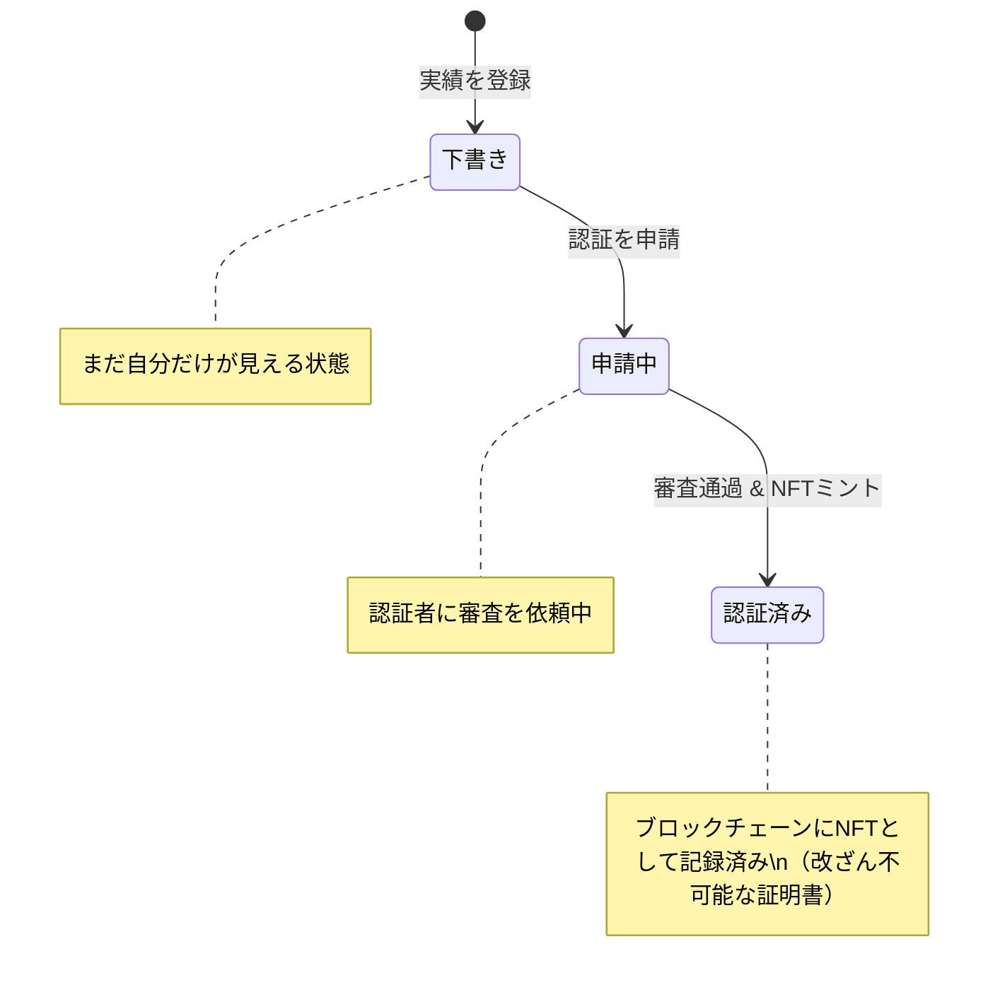
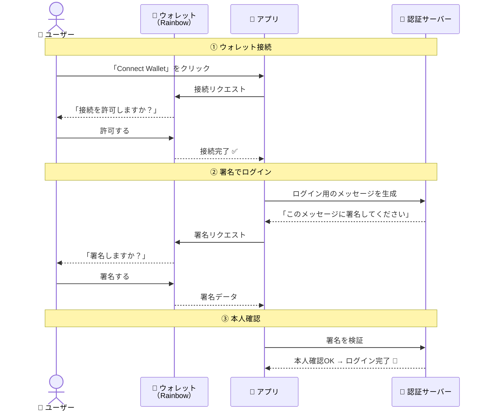
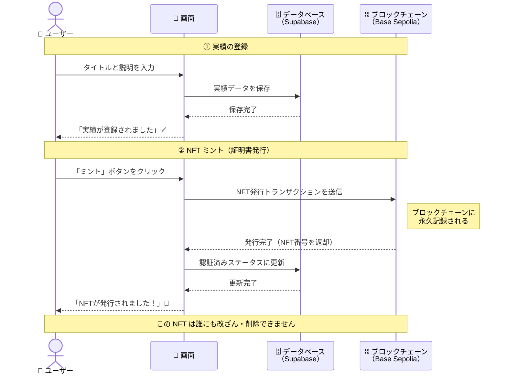

# JobMatching システム構成図

> このドキュメントは、JobMatching のシステム構成を **非エンジニアの方にもわかりやすく** まとめたものです。

---

## 1. システム全体の構成

> 💡 JobMatching は「**ブロックチェーン上に実績を記録する**」Web アプリです。
> ユーザーはウォレット（デジタル財布）でログインし、自分の実績を登録すると、
> それがブロックチェーンに **改ざん不可能な証明書（NFT）** として記録されます。

### 用語解説

| 用語 | 意味 |
|---|---|
| **ウォレット** | 暗号資産を管理するデジタル財布。ログインにも使う |
| **ブロックチェーン** | 改ざんできない分散型の記録台帳 |
| **NFT** | 世界に1つだけのデジタル証明書。コピーや改ざんが不可能 |
| **コントラクト** | ブロックチェーン上で動くプログラム。NFTの発行を担当 |
| **Supabase** | データを保存するクラウドデータベースサービス |
| **Thirdweb** | ブロックチェーンとやり取りするための開発ツール |
| **Base Sepolia** | テスト用のブロックチェーンネットワーク（無料で使える） |

---

## 2. データの構造

> 💡 システムが扱う主なデータは **「ユーザー」** と **「実績」** の2つです。

### 実績のステータス（状態）遷移

---

## 3. ログインの仕組み（SIWE認証）

> 💡 一般的なWebサイトは「メールアドレス＋パスワード」でログインしますが、
> このアプリは **ウォレットの署名**（デジタル署名）で本人確認します。
> パスワードの漏洩リスクがなく、より安全です。

---

## 4. 実績登録からNFT発行までの流れ

> 💡 実績を登録すると、まずデータベースに保存されます。
> 「ミント」ボタンを押すと、その実績がブロックチェーン上に
> **NFT（改ざんできない証明書）** として永久に記録されます。

---

## 5. 技術スタック一覧

> 💡 このアプリを構成している技術の一覧です。

| 役割 | 技術 | ひとことで言うと |
|---|---|---|
| **画面表示** | Next.js + React | Webページを作るフレームワーク |
| **デザイン** | CSS | 見た目のスタイル定義 |
| **ログイン** | RainbowKit + SIWE | ウォレットでログインする仕組み |
| **セッション管理** | NextAuth.js | ログイン状態を維持する仕組み |
| **データ保存** | Supabase | クラウド上のデータベース |
| **ブロックチェーン接続** | Thirdweb SDK | ブロックチェーンとやり取りするツール |
| **NFT 発行** | ERC-721 スマートコントラクト | NFTを発行するプログラム |
| **テスト用チェーン** | Base Sepolia | 無料で使えるテスト環境 |
| **言語** | TypeScript | JavaScript に型安全性を加えた言語 |
